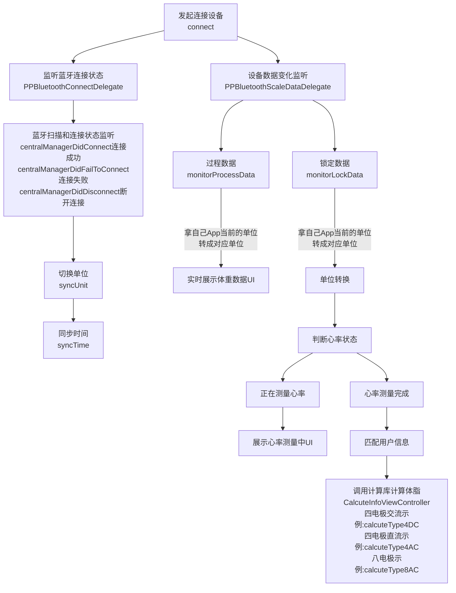
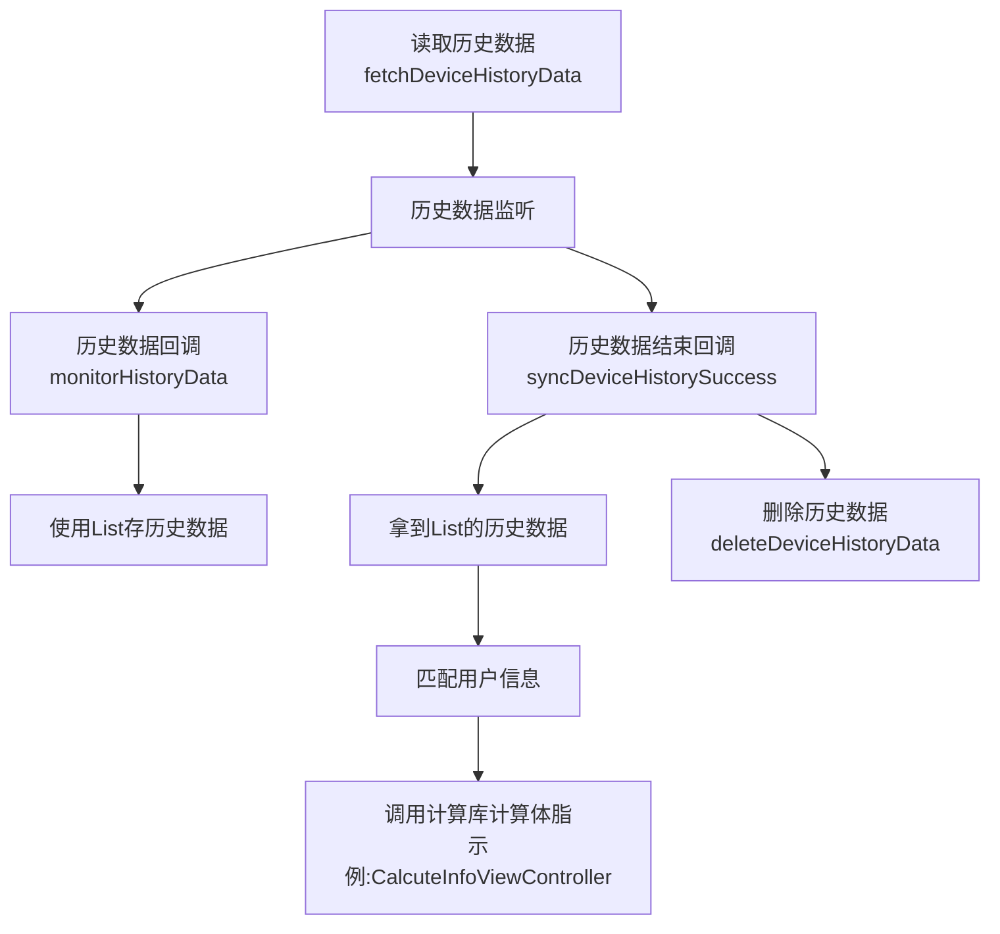
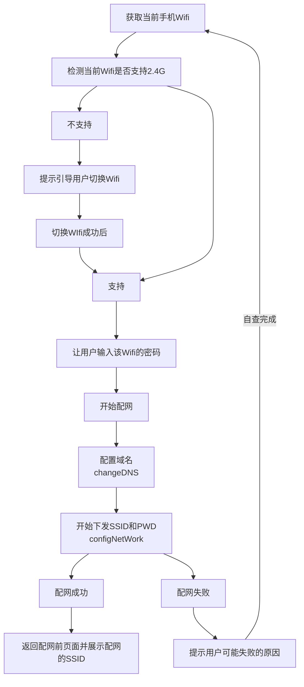
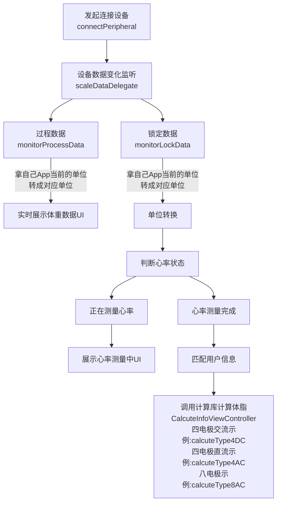
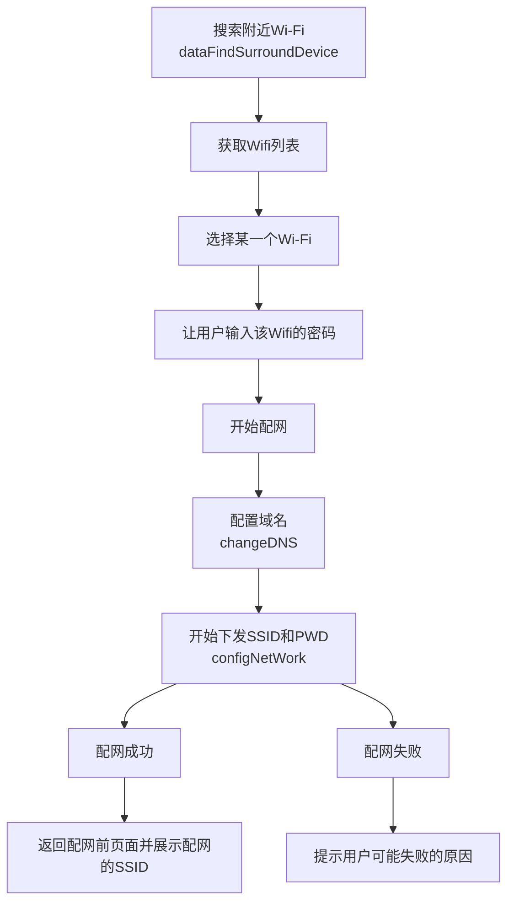
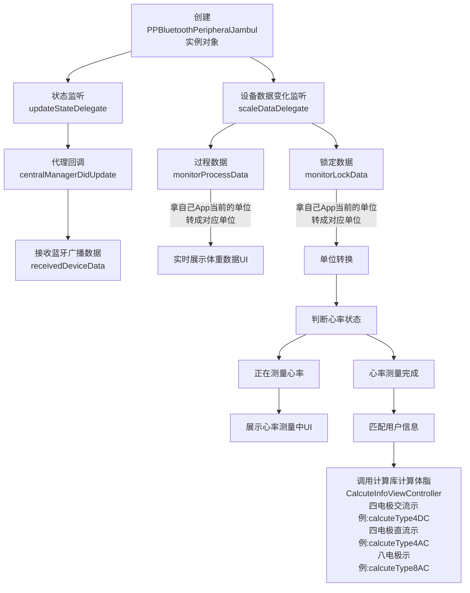
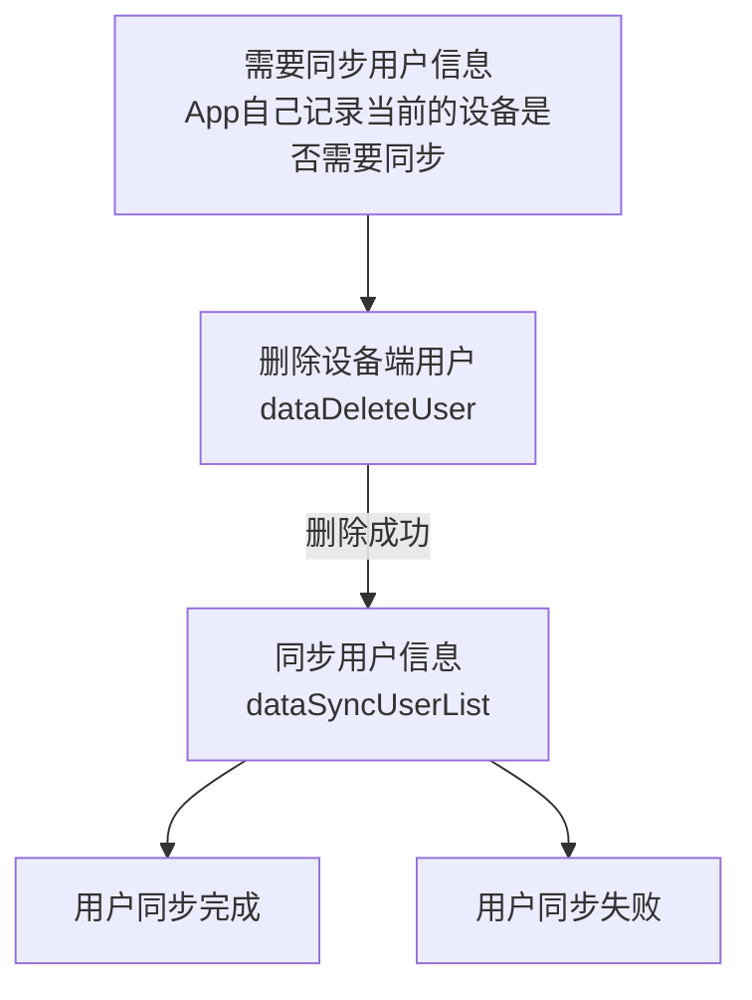

[English Docs](../README_EN.md)  |  [中文文档](../README.md)
相关文档
[乐福开放平台](https://uniquehealth.lefuenergy.com/unique-open-web/#/document)  |    [PPBluetoothKit Android SDK](https://lefuhengqi.apifox.cn/doc-3330813)  |    [PPBluetoothKit 微信小程序插件](https://uniquehealth.lefuenergy.com/unique-open-web/#/document?url=https://lefuhengqi.apifox.cn/doc-2625745)

[iOS示例程序地址](https://gitee.com/shenzhen-lfscale/bluetooth-kit-iosdemo.git)

# 快速链接
- [1.概述](../README.md)
- [2.集成方式](Integration.md)
- [3.设备扫描](SearchDevice.md)
- [4.人体秤接入](BodyScaleIntegrate.md)
- [5.厨房秤接入](KitchenScaleIntegrate.md)
- [6.计算库使用](Calculate.md)

# 人体秤接入

## 人体秤分类：

注：运行本Demo程序，扫描设备，可以获得设备的`PeripheralType`，不同`PeripheralType`的设备“初始化方式”和“支持的功能”有区别，以下为`人体秤`的`PeripheralType `:

| 分类枚举 | 使用示例类 | 连接方式 | 设备类型 | 协议类型 |  
|------|--------|--------|--------|-----|  
| PPDevicePeripheralTypePeripheralApple | DeviceAppleViewController | 连接 | 人体秤 | 2.x | 
| PPDevicePeripheralTypePeripheralBanana | DeviceBananaViewController | 广播 | 人体秤 | 2.x |
| PPDevicePeripheralTypePeripheralCoconut | DeviceCoconutViewController | 连接 | 人体秤 | 3.x |
| PPDevicePeripheralTypePeripheralDurian | DeviceDurianViewController | 设备端计算的连接 | 人体秤 | 2.x |   
| PPDevicePeripheralTypePeripheralTorre | DeviceTorreViewController | 连接 | 人体秤 | Torre |  
| PPDevicePeripheralTypePeripheralIce | DeviceIceViewController | 连接 | 人体秤 | 4.x |  
| PPDevicePeripheralTypePeripheralJambul | DeviceJambulViewController | 广播 | 人体秤 | 3.x |

## 功能说明:

### 2.1 PPDevicePeripheralTypePeripheralApple - DeviceAppleViewController

**注意：**

- 默认已处理完蓝牙权限和开关检测，并匹配到PPDevicePeripheralType的类型为PPDevicePeripheralTypePeripheralApple，2.x /连接 /人体秤
- 需要自行判断是否支持历史，然后再处理历史相关功能
- 需要自行判断是否支持Wifi，然后再处理Wifi相关功能
- Wifi秤需要自行读取当前手机所连接Wifi的ssid，且只支持2.4G或2.4G&5G双模Wifi，不支持单5GWiFi
- Wifi秤配网前需要先配置域名，成功后再下发ssid和pwd
- Wifi秤上传到后台的Wifi历史数据需要Server具备相应的接口能力可咨询Server开发人员

具体的初始化方式和功能演示，请参考本Demo中`DeviceAppleViewController`类

`PPBluetoothKit`中的`PPBluetoothPeripheralApple`类实现了`PPDevicePeripheralTypePeripheralApple`类型设备所支持的功能

```
// PPBluetoothPeripheralApple.h

@interface PPBluetoothPeripheralApple : NSObject

@property (nonatomic, weak) id<PPBluetoothServiceDelegate> serviceDelegate;

@property (nonatomic, weak) id<PPBluetoothCMDDataDelegate> cmdDelegate;

@property (nonatomic, weak) id<PPBluetoothScaleDataDelegate> scaleDataDelegate;

@property (nonatomic, strong) CBPeripheral *peripheral;

- (instancetype)initWithPeripheral:(CBPeripheral *)peripheral  andDevice:(PPBluetoothAdvDeviceModel *)device;

- (void)discoverDeviceInfoService:(void(^)(PPBluetooth180ADeviceModel *deviceModel))deviceInfoResponseHandler;

- (void)discoverFFF0Service;

/// 获取设备离线称重数据
- (void)fetchDeviceHistoryData;

/// 删除设备离线称重数据
- (void)deleteDeviceHistoryData;

/// 同步时间
- (void)syncDeviceTime;

/// 同步配置信息
- (void)syncDeviceSetting:(PPBluetoothDeviceSettingModel *)settingModel;


/// 恢复出厂状态
/// - Parameter handler:
- (void)restoreFactoryWithHandler:(void(^)(void))handler;

/// 配网
/// - Parameters:
///   - model: name 和 pwd
///   - handler:
- (void)configNetWorkWithSSID:(NSString *)ssid password:(NSString *)password handler:(void(^)(NSString *sn, PPBluetoothAppleWifiConfigState configState))handler;

/// 设置DNS，即服务器域名
/// - Parameters:
///   - dns: 域名
///   - handler:
- (void)changeDNS:(NSString *)dns withHandler:(void(^)(NSInteger statu))handler;

/// 查询wifi参数
/// - Parameter handler:
- (void)queryWifiConfigWithHandler:(void (^)(PPWifiInfoModel * _Nullable))handler;

@end
```

#### 2.1.1 称重逻辑



#### 2.1.2 完整的读取蓝牙历史数据

**前提：蓝牙已连接**



#### 2.1.3 完整的Wifi配网流程

**前提：蓝牙已连接**

注意：

1. 确保Server正常，路由器能正常连接到Server
2. 确保WiFi环境是2.4G或2.4/5G混合模式，不支持单5G模式
3. 确保账号密码正确
4. 确保秤端使用的Server地址与App使用的Server地址对应



### 2.2 PPDevicePeripheralTypePeripheralBanana 功能说明 -DeviceBananaViewController

**注意：**

- 默认已处理完蓝牙权限和开关检测，并匹配到PPDevicePeripheralType的类型为PPDevicePeripheralTypePeripheralBanana，2.x /广播 /人体秤

具体的初始化方式和功能演示，请参考本Demo中`DeviceBananaViewController`类

#### 2.2.1 完整的称重逻辑


### 2.3 PPDevicePeripheralTypePeripheralCoconut功能说明 -DeviceCoconutViewController

**注意：**

- 默认已处理完蓝牙权限和开关检测，并匹配到`PPDevicePeripheralType`的类型为PPDevicePeripheralTypePeripheralCoconut，3.x /连接 /人体秤

具体的初始化方式和功能演示，请参考本Demo中`DeviceCoconutViewController`类

#### 2.3.1 称重逻辑



#### 2.3.2 读取蓝牙历史数据

**前提：蓝牙已连接**


### 2.4 PPDevicePeripheralTypePeripheralDurian功能说明 -DeviceDurianViewController

**注意：**

- 默认已处理完蓝牙权限和开关检测，并匹配到PPDevicePeripheralType的类型为PPDevicePeripheralTypePeripheralDurian，2.x /设备端计算的连接/人体秤

具体的初始化方式和功能演示，请参考本Demo中`DeviceDurianViewController`类

#### 2.4.1 称重逻辑


### 2.5 PPDevicePeripheralTypePeripheralIce功能说明 -DeviceIceViewController

**注意：**

- 默认已处理完蓝牙权限和开关检测，并匹配到PPDevicePeripheralType的类型为PPDevicePeripheralTypePeripheralIce，4.0 /连接 /人体秤

具体的初始化方式和功能演示，请参考本Demo中`DeviceIceViewController`类

#### 2.5.1 称重逻辑


#### 2.5.2 读取蓝牙历史数据

**前提：蓝牙已连接**


#### 2.5.3 配网流程

**前提：蓝牙已连接**
注意：

1. 确保Server正常，路由器能正常连接到Server
2. 确保WiFi环境是2.4G或2.4/5G混合模式，不支持单5G模式
3. 确保账号密码正确
4. 确保秤端使用的Server地址与App使用的Server地址对应



### 2.6 PPDevicePeripheralTypePeripheralJambul功能说明 -DeviceJambulViewController

**注意：**

- 默认已处理完蓝牙权限和开关检测，并匹配到PPDevicePeripheralType的类型为PPDevicePeripheralTypePeripheralJambul，3.x /广播 /人体秤

具体的初始化方式和功能演示，请参考本Demo中`DeviceJambulViewController`类

#### 2.6.1 完整的称重逻辑



### 2.7 PPDevicePeripheralTypePeripheralTorre功能说明 -DeviceTorreViewController

**注意：**

- 默认已处理完蓝牙权限和开关检测，并匹配到PPDevicePeripheralType的类型为PPDevicePeripheralTypePeripheralTorre，TORRE/连接 /人体秤
- 需要自行判断是否支持历史，然后再处理历史相关功能
- 需要自行判断是否支持Wifi，然后再处理Wifi相关功能

具体的初始化方式和功能演示，请参考本Demo中`DeviceTorreViewController`类

#### 2.7.1 称重流程

**前提：蓝牙已连接**


#### 2.7.2 完整的用户信息同步流程

**前提：蓝牙已连接**



#### 2.7.3 完整的配网流程

**前提：蓝牙已连接**
注意：

1. 确保Server正常，路由器能正常连接到Server
2. 确保WiFi环境是2.4G或2.4/5G混合模式，不支持单5G模式
3. 确保账号密码正确
4. 确保秤端使用的Server地址与App使用的Server地址对应


#### 2.7.4 支持的功能-PPBluetoothPeripheralTorre

```
// PPBluetoothPeripheralTorre.h

@interface PPBluetoothPeripheralTorre : NSObject

@property (nonatomic, weak) id<PPBluetoothServiceDelegate> serviceDelegate;

@property (nonatomic, weak) id<PPBluetoothScaleDataDelegate> scaleDataDelegate;

@property (nonatomic, strong) CBPeripheral *peripheral;

@property (nonatomic, strong) PPBluetoothAdvDeviceModel *deviceAdv;

- (instancetype)initWithPeripheral:(CBPeripheral *)peripheral  andDevice:(PPBluetoothAdvDeviceModel *)device;

- (void)discoverDeviceInfoService:(void(^)(PPBluetooth180ADeviceModel *deviceModel))deviceInfoResponseHandler;

- (void)discoverFFF0Service;

#pragma mark - code

/// 保活指令 - 推荐首次连接成功后每10秒调用一次，可以保证设备不会主动断开连接
- (void)sendKeepAliveCode;

/// 开启抱婴模式
/// - Parameters:
///   - step: 0/1 标识第几次上称
///   - weight: 上次上称时候的重量，step为0时传0
///   - handler: 0设置成功 1设置失败
- (void)codeEnableBabyModel:(NSInteger)step weight:(NSInteger)weight withHandler:(void(^)(NSInteger status))handler;

/// 退出抱婴模式
/// - Parameter handler: 0设置成功 1设置失败
- (void)codeExitBabyModel:(void(^)(NSInteger status))handler;


/// 开始测量 - 下发此指令后设备才会上报称重情况
/// - Parameter handler: 0设置成功 1设置失败
- (void)codeStartMeasure:(void(^)(NSInteger status))handler;

/// 停止测量
/// - Parameter handler: 0设置成功 1设置失败
- (void)codeStopMeasure:(void(^)(NSInteger status))handler;


/// 更新MTU - 推荐在设备连接成功后调用，更大的MTU可以加快与设备的指令交互速度。默认为20
/// - Parameter handler: 0设置成功 1设置失败
- (void)codeUpdateMTU:(void(^)(NSInteger status))handler;


/// 同步设备时间
/// - Parameter handler: 0设置成功 1设置失败
- (void)codeSyncTime:(void(^)(NSInteger status))handler;

/// 获取设备单位
/// - Parameter handler:
/// 0x00：单位kg
/// 0x01：单位lb
/// 0x02：单位斤
/// 0x03：单位st
/// 0x04：单位st:lb
- (void)codeFetchUnit:(void(^)(NSInteger status))handler;


/// 修改设备单位
/// - Parameters:
///   - unit: 单位
///   - handler:
///   0x00：设置成功
///   0x01：设置失败
- (void)codeChangeUnit:(PPDeviceUnit)unit withHandler:(void(^)(NSInteger status))handler;


/// 通过WIFI进行OTA - 调用此方法前请确保设备已经配网
/// - Parameter handler:
///        0x00-成功
///        0x01-设备已在升级中不能再次启动升级
///        0x02-设备低电量无法启动升级
- (void)codeOtaUpdateWithHandler:(void(^)(NSInteger status))handler;

/// 清除设备数据
/// - Parameters:
///   - cmd:
///         0x00：清除所有设备数据(用户信息、历史数据、配网数据、设置信息)
///         0x01：清除用户信息
///         0x02：清除历史数据
///         0x03：清除配网状态
///         0x04：清除设置信息
///   - handler:
///        0x00-成功
///        0x01-失败
- (void)codeClearDeviceData:(NSInteger)cmd withHandler:(void(^)(NSInteger status))handler;

/// 获取心率开关状态
/// - Parameter handler: 0心率测量打开 1心率测量关闭
- (void)codeFetchHeartRateSwitch:(void(^)(NSInteger status))handler;

/// 打开心率测量
/// - Parameter handler: 0设置成功 1设置失败
- (void)codeOpenHeartRateSwitch:(void(^)(NSInteger status))handler;

/// 关闭心率测量
/// - Parameter handler:  0设置成功 1设置失败
- (void)codeCloseHeartRateSwitch:(void(^)(NSInteger status))handler;

/// 获取阻抗开关状态
/// - Parameter handler: 0心率测量打开 1心率测量关闭
- (void)codeFetchImpedanceSwitch:(void(^)(NSInteger status))handler;

/// 打开阻抗测量
/// - Parameter handler: 0设置成功 1设置失败
- (void)codeOpenImpedanceSwitch:(void(^)(NSInteger status))handler;

/// 关闭阻抗测量
/// - Parameter handler:  0设置成功 1设置失败
- (void)codeCloseImpedanceSwitch:(void(^)(NSInteger status))handler;

/// 获取设备配网状态
/// - Parameter handler:
///0x00：未配网（设备端恢复出厂或APP解除设备配网后状态）
///0x01：已配网（APP已配网状态）
- (void)codeFetchWifiConfig:(void(^)(NSInteger status))handler;

/// 设置设备绑定状态
/// - Parameter handler:  0设置成功 1设置失败
- (void)codeSetBindingState:(void(^)(NSInteger status))handler;

/// 设置设备未绑定状态
/// - Parameter handler:  0设置成功 1设置失败
- (void)codeSetUnbindingState:(void(^)(NSInteger status))handler;

/// 获取设备绑定状态
/// - Parameter handler:
///0x00：设备未绑定
///0x01：设备已绑定
- (void)codeFetchBindingState:(void(^)(NSInteger status))handler;


/// 获取 WIFI MAC 地址
/// - Parameter handler:
/// WIFI MAC 地址
/// 举例：MAC 地址：01:02:03:04:05:06
/// 备注：
/// MAC地址为 00:00:00:00:00:00时表明wifi mac获取不到
///
- (void)codeFetchWifiMac:(void(^)(NSString *wifiMac))handler;


/// 获取设备屏幕亮度
/// - Parameter handler: 0-100的数值用来表示屏幕亮度
- (void)codeFetchScreenLuminance:(void(^)(NSInteger status))handler;


/// 设置屏幕亮度
/// - Parameters:
///   - progress: 0-100
///   - handler: 0设置成功 1设置失败
- (void)codeSetScreenLuminance:(NSInteger)progress handler:(void(^)(NSInteger status))handler;


#pragma mark - data

#pragma mark - 用户数据相关


/// 同步用户列表给设备 - 设备中如果有此用户会更新用户信息，若没有会插入给设备
/// - Parameters:
///   - infos: 用户列表 - 对象中的每个属性都要赋值
///   - handler:  0设置成功 1设置失败
- (void)dataSyncUserList:(NSArray <PPTorreSettingModel *>*)infos withHandler:(void(^)(NSInteger status))handler;


/// 同步单个用户给设备 - 设备中如果有此用户会更新用户信息，若没有会插入给设备
/// - Parameters:
///   - infos: 单个用户信息 - 对象中的每个属性都要赋值
///   - handler:  0设置成功 1设置失败
- (void)dataSyncUserInfo:(PPTorreSettingModel *)infos withHandler:(void(^)(NSInteger status))handler;


/// 选中测量用户 -  用于测量过程中指定测量用户，指定后不需要在设备端进行选择
/// - Parameters:
///   - userModel: 单个用户信息 - userId、memberId为必传项
///   - handler:  0设置成功 1设置失败
- (void)dataSelectUser:(PPTorreSettingModel *)userModel withHandler:(void(^)(NSInteger status))handler;


/// 删除用户
/// - Parameters:
///   - userModel: 单个用户信息 - userId、memberId为必传项
///   - handler:  0设置成功 1设置失败
- (void)dataDeleteUser:(PPTorreSettingModel *)userModel withHandler:(void(^)(NSInteger status))handler;


/// 获取设备端用户列表
/// - Parameter handler: 返回设备端所有用户的userId
- (void)dataFetchUserID:(void(^)(NSArray <NSString *>* infos))handler;

#pragma mark - 配网相关


/// 发现周围的可连接热点
/// - Parameter handler: 结果 - 一个数组对象包含了热点名称和强度
- (void)dataFindSurroundDevice:(void(^)(NSArray <PPWifiInfoModel *>*devices))handler;


/// 配置热点
/// - Parameters:
///   - model: 包含用于连接热点的信息
///   - handler: state 配网过程中的状态 errorCode 错误码
- (void)dataConfigNetWork:(PPWifiInfoModel *)model domain:(NSString *)domain withHandler:(void(^)(PPWIFIConfigState state,  NSData *_Nullable errorCode))handler;


/// 退出配网模式
/// - Parameter handler: 0设置成功 1设置失败
- (void)dataExitWifiConfig:(void(^)(NSInteger status))handler;


/// 获取设备当前配置热点的ssid
/// - Parameter handler: ssid名称
- (void)dataFetchConfigNetworkSSID:(void(^)(NSString *ssid))handler;

#pragma mark - 历史数据

- (void)dataHistoricalDataStatusReport:(void(^)(void))handler;

/// 获取某个用户下所有成员的历史记录
/// - Parameters:
///   - userMode: 用户对象 userId 为必传项
///   - handler: 历史数据结果
- (void)dataFetchHistoryData:(PPTorreSettingModel *)userMode withHandler:(void(^)(NSArray <PPBluetoothScaleBaseModel *>* history))handler;

#pragma mark - 日志


/// 同步设备端日志
/// - Parameter handler: progress 进度 0-1 filePath 文件保存的路径 isFailed 是否失败
- (void)dataSyncLog:(void(^)(CGFloat progress, NSString *filePath, BOOL isFailed))handler;


#pragma mark - DFU


/// DFU升级开始
/// - Parameter handler: 切片大小
- (void)dataDFUStart:(void(^)(NSInteger size))handler;


/// 获取DFU状态
/// - Parameter handler: handler description
/// transferContinueStatus
///断点续传状态
///0-从上次的断点开始传输
///1-从头开始传输
///fileType
///上次断点DFU文件类型
///当断点续传状态等于0时此状态生效
///version
///上次断点DFU文件版本号-ANSSI码
///当断点续传状态等于0时此状态生效
///offset
///上次断点DFU文件已升级大小-文件OFFSET,APP根据此偏移继续下发升级数据，实现断点续传状态
///当断点续传状态等于0时此状态生效

- (void)dataDFUCheck:(void(^)(NSInteger transferContinueStatus, NSInteger fileType, NSString *version, NSInteger offset))handler;


/// DFU文件发送
/// - Parameters:
///   - packageModel: 包含DFU文件内容的对象
///   - size: 切片大小
///   - transferContinueStatus: 断点续传状态
///   - version: 当前DFU文件的云端版本号
///   - handler: 成功回调
- (void)dataDFUSend:(PPTorreDFUPackageModel *)packageModel
      maxPacketSize:(NSInteger)maxPacketSize
transferContinueStatus:(NSInteger)transferContinueStatus
      deviceVersion:(NSString *)version
            handler:(void(^)(CGFloat progress, BOOL isSuccess))handler;

@end
```

<br/>
<br/>

[上一页: 3.设备扫描](SearchDevice.md)
&nbsp;&nbsp;&nbsp;&nbsp;&nbsp;&nbsp;&nbsp;&nbsp;&nbsp;&nbsp;&nbsp;&nbsp;&nbsp;&nbsp;&nbsp;&nbsp;&nbsp;&nbsp;&nbsp;&nbsp;&nbsp;&nbsp;&nbsp;&nbsp;&nbsp;&nbsp;&nbsp;&nbsp;&nbsp;&nbsp;&nbsp;&nbsp;&nbsp;&nbsp;&nbsp;&nbsp;&nbsp;&nbsp;
[下一页: 5.厨房秤接入](KitchenScaleIntegrate.md)


