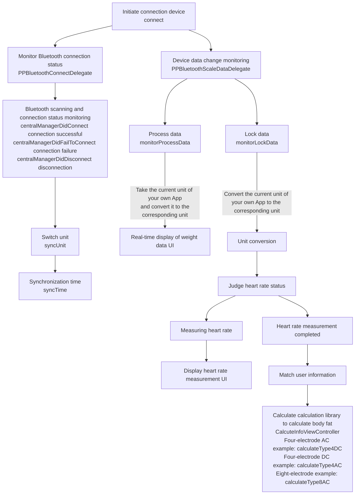
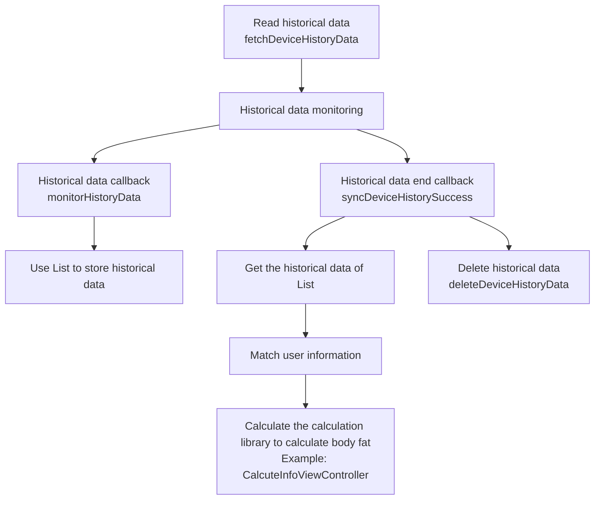
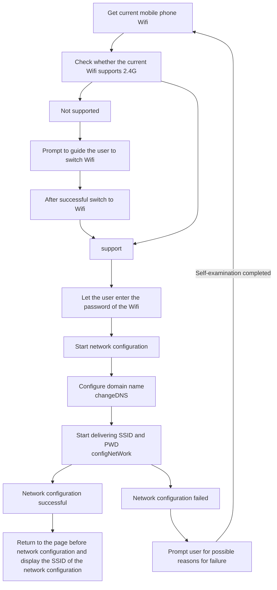
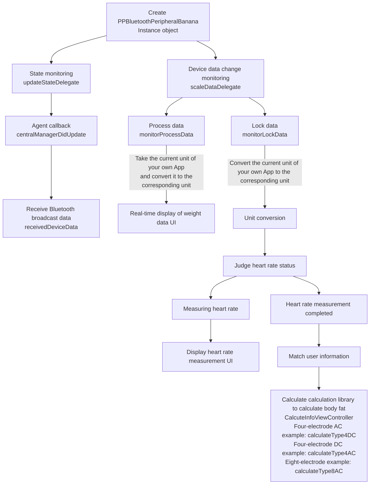
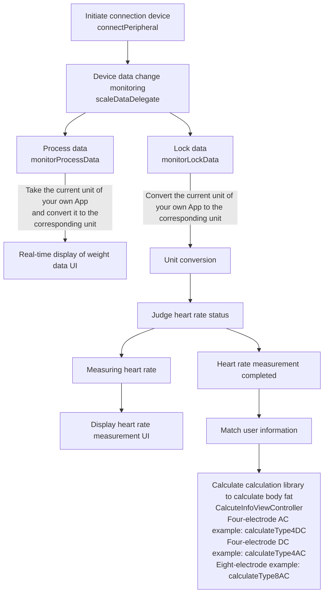
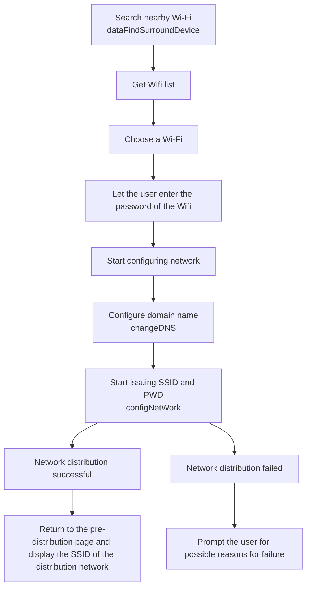
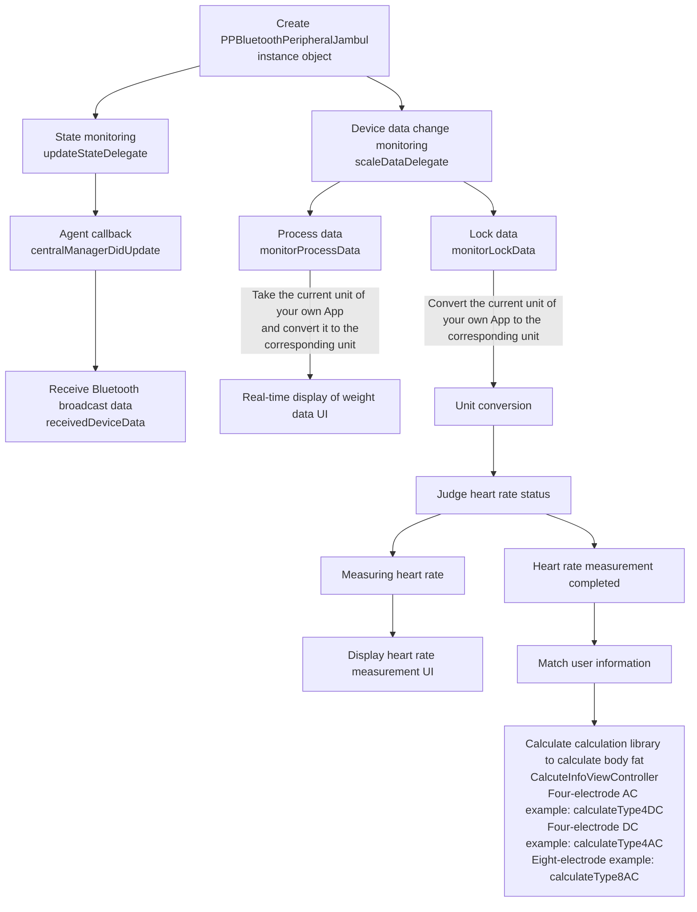
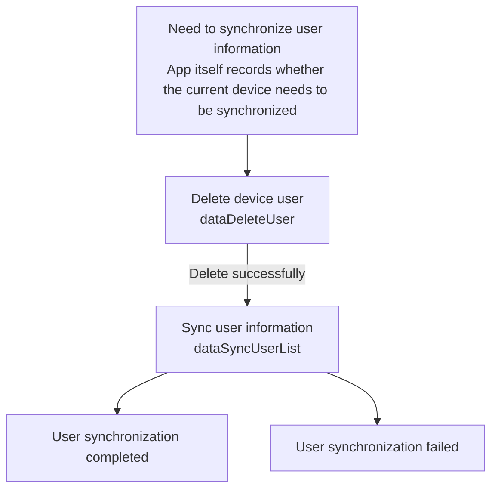

[English Docs](../README_EN.md)  |  [中文文档](../README.md)
Related documents
[Lefu Open Platform](https://uniquehealth.lefuenergy.com/unique-open-web/#/document)  |    [PPBluetoothKit Android SDK](https://lefuhengqi.apifox.cn/doc-3330813)  |    [PPBluetoothKit WeChat mini program plug-in](https://uniquehealth.lefuenergy.com/unique-open-web/#/document?url=https://lefuhengqi.apifox.cn/doc-2625745)

[iOS sample program address](https://gitee.com/shenzhen-lfscale/bluetooth-kit-iosdemo.git)

# Quick Links
- [1.Overview](../README_EN.md)
- [2.Integration method](Integration_EN.md)
- [3.Device scanning](SearchDevice_EN.md)
- [4.Integrated body scale](BodyScaleIntegrate_EN.md)
- [5.Integrated kitchen scale](KitchenScaleIntegrate_EN.md)
- [6.Calculation library usage](Calculate_EN.md)

# Integrated body scale

## Body scale classification：

Note: Run Demo program and scan the device to get the `PeripheralType` of the device. The "initialization method" and "supported functions" of devices with different `PeripheralType` are different. The following is the `PeripheralType` of `Body Scale`:

| Classification enumeration | Usage example class | Connection method | Device type | Protocol type |
|------|--------|--------|--------|-----|
| PPDevicePeripheralTypePeripheralApple | DeviceAppleViewController | Connection | Body Scale | 2.x |
| PPDevicePeripheralTypePeripheralBanana | DeviceBananaViewController | Broadcast | Body Scale | 2.x |
| PPDevicePeripheralTypePeripheralCoconut | DeviceCoconutViewController | Connection | Body Scale | 3.x |
| PPDevicePeripheralTypePeripheralDurian | DeviceDurianViewController | Connections for device-side computing | Body Scale | 2.x |
| PPDevicePeripheralTypePeripheralTorre | DeviceTorreViewController | Connection | Body Scale | Torre |
| PPDevicePeripheralTypePeripheralIce | DeviceIceViewController | Connection | Body Scale | 4.x |

## Function Description:

### 2.1 PPDevicePeripheralTypePeripheralApple - DeviceAppleViewController

**Notice:**

- By default, Bluetooth permission and switch detection have been processed, and the type of PPDevicePeripheralType matched is PPDevicePeripheralTypePeripheralApple, 2.x/Connection/Body Scale
- You need to judge whether history is supported before handling history-related functions.
- You need to judge whether it supports Wifi by yourself, and then handle Wifi related functions.
- The Wifi scale needs to read the SSID of the Wifi currently connected to the mobile phone by itself, and only supports 2.4G or 2.4G&5G dual-mode Wifi, and does not support single 5GWiFi.
- Before configuring the Wifi scale, you need to configure the domain name first, and then issue the ssid and pwd after success.
- The Wifi historical data uploaded by the Wifi scale to the background requires the Server to have corresponding interface capabilities. Please consult the Server developer.

For specific initialization methods and functional demonstrations, please refer to the `DeviceAppleViewController` class in this Demo

The `PPBluetoothPeripheralApple` class in `PPBluetoothKit` implements the functions supported by `PPDevicePeripheralTypePeripheralApple` type devices

```
// PPBluetoothPeripheralApple.h

@interface PPBluetoothPeripheralApple : NSObject

 
@property (nonatomic, weak) id<PPBluetoothServiceDelegate> serviceDelegate;

@property (nonatomic, weak) id<PPBluetoothCMDDataDelegate> cmdDelegate;

 
@property (nonatomic, weak) id<PPBluetoothScaleDataDelegate> scaleDataDelegate;

@property (nonatomic, strong) CBPeripheral *peripheral;

- (instancetype)initWithPeripheral:(CBPeripheral *)peripheral andDevice:(PPBluetoothAdvDeviceModel *)device;

 
- (void)discoverDeviceInfoService:(void(^)(PPBluetooth180ADeviceModel *deviceModel))deviceInfoResponseHandler;

 
- (void)discoverFFF0Service;

 
/// Get equipment offline weighing data

- (void)fetchDeviceHistoryData;

 
/// Delete device offline weighing data

- (void)deleteDeviceHistoryData;

 
/// synchronised time

- (void)syncDeviceTime;

/// Synchronize configuration information

- (void)syncDeviceSetting:(PPBluetoothDeviceSettingModel *)settingModel;

 

/// Restore factory status

/// - Parameter handler:

- (void)restoreFactoryWithHandler:(void(^)(void))handler;

/// Distribution network

/// - Parameters:

/// - model: name and pwd

/// - handler:

- (void)configNetWorkWithSSID:(NSString *)ssid password:(NSString *)password handler:(void(^)(NSString *sn, PPBluetoothAppleWifiConfigState configState))handler;

 
///Set DNS, that is, server domain name

/// - Parameters:

/// - dns: domain name

/// - handler:

- (void)changeDNS:(NSString *)dns withHandler:(void(^)(NSInteger statu))handler;

/// Query wifi parameters

/// - Parameter handler:

- (void)queryWifiConfigWithHandler:(void (^)(PPWifiInfoModel * _Nullable))handler;

 

@end
```

#### 2.1.1 Weighing logic



#### 2.1.2 Read complete Bluetooth history data

**Prerequisite: Bluetooth is connected**



#### 2.1.3 Complete Wifi distribution process

**Prerequisite: Bluetooth is connected**

Notice:

1. Make sure the server is normal and the router can connect to the server normally.
2. Make sure the WiFi environment is 2.4G or 2.4/5G mixed mode. Single 5G mode is not supported.
3. Make sure the account password is correct
4. Make sure that the server address used by the scale corresponds to the server address used by the App.



### 2.2 PPDevicePeripheralTypePeripheralBanana Function Description-DeviceBananaViewController

**Notice:**

- By default, Bluetooth permission and switch detection have been processed, and the type of PPDevicePeripheralType matched is PPDevicePeripheralTypePeripheralBanana, 2.x/broadcast/body scale

For specific initialization methods and functional demonstrations, please refer to the `DeviceBananaViewController` class in this Demo

#### 2.2.1 Complete weighing logic



### 2.3 PPDevicePeripheralTypePeripheralCoconut function description-DeviceCoconutViewController

**Notice:**

- By default, Bluetooth permission and switch detection have been processed, and the type of `PPDevicePeripheralType` is matched to PPDevicePeripheralTypePeripheralCoconut, 3.x/Connection/Body Scale

For specific initialization methods and functional demonstrations, please refer to the `DeviceCoconutViewController` class in this Demo

#### 2.3.1 Weighing logic



#### 2.3.2 Read Bluetooth historical data

**Prerequisite: Bluetooth is connected**


### 2.4 PPDevicePeripheralTypePeripheralDurian Function Description-DeviceDurianViewController

**Notice:**

- By default, Bluetooth permissions and switch detection have been processed, and the type of PPDevicePeripheralType is matched to PPDevicePeripheralTypePeripheralDurian, 2.x/device-side calculated connection/body scale

For specific initialization methods and functional demonstrations, please refer to the `DeviceDurianViewController` class in this Demo

#### 2.4.1 Weighing logic


### 2.5 PPDevicePeripheralTypePeripheralIce Function Description-DeviceIceViewController

**Notice:**

- By default, Bluetooth permission and switch detection have been processed, and the type of PPDevicePeripheralType matched is PPDevicePeripheralTypePeripheralIce, 4.0/Connection/Body Scale

For specific initialization methods and functional demonstrations, please refer to the `DeviceIceViewController` class in this Demo

#### 2.5.1 Weighing logic


#### 2.5.2 Read Bluetooth historical data

**Prerequisite: Bluetooth is connected**


#### 2.5.3 Network distribution process

**Prerequisite: Bluetooth is connected**

Notice:

1. Make sure the server is normal and the router can connect to the server normally.
2. Make sure the WiFi environment is 2.4G or 2.4/5G mixed mode. Single 5G mode is not supported.
3. Make sure the account password is correct
4. Make sure that the server address used by the scale corresponds to the server address used by the App.



### 2.6 PPDevicePeripheralTypePeripheralJambul function description-DeviceJambulViewController

**Notice:**

- By default, Bluetooth permission and switch detection have been processed, and the type of PPDevicePeripheralType matched is PPDevicePeripheralTypePeripheralJambul, 3.x/broadcast/body scale

For specific initialization methods and functional demonstrations, please refer to the `DeviceJambulViewController` class in this Demo

#### 2.6.1 Complete weighing logic



### 2.7 PPDevicePeripheralTypePeripheralTorre Function Description-DeviceTorreViewController

**Notice:**

- By default, Bluetooth permission and switch detection have been processed, and the type of PPDevicePeripheralType matched is PPDevicePeripheralTypePeripheralTorre, TORRE/Connection/Body Scale
- You need to judge whether history is supported before handling history-related functions.
- You need to judge whether it supports Wifi by yourself, and then handle Wifi related functions.

For specific initialization methods and functional demonstrations, please refer to the `DeviceTorreViewController` class in this Demo

#### 2.7.1 Weighing process

**Prerequisite: Bluetooth is connected**


#### 2.7.2 Complete user information synchronization process

**Prerequisite: Bluetooth is connected**



#### 2.7.3 Complete network distribution process

**Prerequisite: Bluetooth is connected**

Notice:

1. Make sure the server is normal and the router can connect to the server normally.
2. Make sure the WiFi environment is 2.4G or 2.4/5G mixed mode. Single 5G mode is not supported.
3. Make sure the account password is correct
4. Make sure that the server address used by the scale corresponds to the server address used by the App.


#### 2.7.4 Supported functions-PPBluetoothPeripheralTorre

```
// PPBluetoothPeripheralTorre.h

@interface PPBluetoothPeripheralTorre : NSObject

@property (nonatomic, weak) id<PPBluetoothServiceDelegate> serviceDelegate;

@property (nonatomic, weak) id<PPBluetoothScaleDataDelegate> scaleDataDelegate;

@property (nonatomic, strong) CBPeripheral *peripheral;

@property (nonatomic, strong) PPBluetoothAdvDeviceModel *deviceAdv;

- (instancetype)initWithPeripheral:(CBPeripheral *)peripheral  andDevice:(PPBluetoothAdvDeviceModel *)device;

- (void)discoverDeviceInfoService:(void(^)(PPBluetooth180ADeviceModel *deviceModel))deviceInfoResponseHandler;

- (void)discoverFFF0Service;

#pragma mark - code

/// Keep-alive command - It is recommended to call it every 10 seconds after the first successful connection to ensure that the device will not actively disconnect

- (void)sendKeepAliveCode;

 

/// Turn on baby mode

/// - Parameters:

/// - step: 0/1 identifies the number of times to go up.

/// - weight: The weight of the last weighing, when step is 0, pass 0

/// - handler: 0 set successfully 1 set failed

- (void)codeEnableBabyModel:(NSInteger)step weight:(NSInteger)weight withHandler:(void(^)(NSInteger status))handler;

 

/// Exit baby hug mode

/// - Parameter handler: 0 set successfully 1 set failed

- (void)codeExitBabyModel:(void(^)(NSInteger status))handler;

 

 

/// Start measurement - the device will report the weighing status only after this command is issued.

/// - Parameter handler: 0 set successfully 1 set failed

- (void)codeStartMeasure:(void(^)(NSInteger status))handler;

 

/// Stop measurement

/// - Parameter handler: 0 set successfully 1 set failed

- (void)codeStopMeasure:(void(^)(NSInteger status))handler;

 

 

/// Update MTU - Recommended to be called after the device is successfully connected. A larger MTU can speed up command interaction with the device. Default is 20

/// - Parameter handler: 0 set successfully 1 set failed

- (void)codeUpdateMTU:(void(^)(NSInteger status))handler;

 

 

/// Synchronize device time

/// - Parameter handler: 0 set successfully 1 set failed

- (void)codeSyncTime:(void(^)(NSInteger status))handler;

 

/// Get the device unit

/// - Parameter handler:

/// 0x00: unit kg

/// 0x01: unit lb

/// 0x02: Unit catties

/// 0x03: unit st

/// 0x04: unit st: lb

- (void)codeFetchUnit:(void(^)(NSInteger status))handler;

 

 

/// Modify equipment unit

/// - Parameters:

/// - unit: unit

/// - handler:

/// 0x00: Setting successful

/// 0x01: Setting failed

- (void)codeChangeUnit:(PPDeviceUnit)unit withHandler:(void(^)(NSInteger status))handler;

 

 

/// OTA via WIFI - please ensure that the device has been configured with the network before calling this method

/// - Parameter handler:

/// 0x00-success

/// 0x01-The device is already being upgraded and the upgrade cannot be started again.

/// 0x02-The device has low power and cannot start the upgrade.

- (void)codeOtaUpdateWithHandler:(void(^)(NSInteger status))handler;

 

/// Clear device data

/// - Parameters:

/// - cmd:

/// 0x00: Clear all device data (user information, historical data, network configuration data, setting information)

/// 0x01: Clear user information

/// 0x02: Clear historical data

/// 0x03: Clear network configuration status

/// 0x04: Clear setting information

/// - handler:

/// 0x00-success

/// 0x01-Failed

- (void)codeClearDeviceData:(NSInteger)cmd withHandler:(void(^)(NSInteger status))handler;

 

/// Get the heart rate switch status

/// - Parameter handler: 0 Heart rate measurement on 1 Heart rate measurement off

- (void)codeFetchHeartRateSwitch:(void(^)(NSInteger status))handler;

 

/// Turn on heart rate measurement

/// - Parameter handler: 0 set successfully 1 set failed

- (void)codeOpenHeartRateSwitch:(void(^)(NSInteger status))handler;

 

/// Turn off heart rate measurement

/// - Parameter handler: 0 set successfully 1 set failed

- (void)codeCloseHeartRateSwitch:(void(^)(NSInteger status))handler;

 

/// Get the impedance switch status

/// - Parameter handler: 0 Heart rate measurement on 1 Heart rate measurement off

- (void)codeFetchImpedanceSwitch:(void(^)(NSInteger status))handler;

 

/// Turn on impedance measurement

/// - Parameter handler: 0 set successfully 1 set failed

- (void)codeOpenImpedanceSwitch:(void(^)(NSInteger status))handler;

 

/// Turn off impedance measurement

/// - Parameter handler: 0 set successfully 1 set failed

- (void)codeCloseImpedanceSwitch:(void(^)(NSInteger status))handler;

 

/// Get the device configuration status

/// - Parameter handler:

///0x00: Not configured with a network (the device is restored to factory settings or the APP releases the device from network configuration)

///0x01: Network has been configured (APP has been configured with network status)

- (void)codeFetchWifiConfig:(void(^)(NSInteger status))handler;

 

///Set device binding status

/// - Parameter handler: 0 set successfully 1 set failed

- (void)codeSetBindingState:(void(^)(NSInteger status))handler;

 

///Set the device unbound status

/// - Parameter handler: 0 set successfully 1 set failed

- (void)codeSetUnbindingState:(void(^)(NSInteger status))handler;

 

/// Get device binding status

/// - Parameter handler:

///0x00: The device is not bound

///0x01: The device has been bound

- (void)codeFetchBindingState:(void(^)(NSInteger status))handler;

 

 

/// Get WIFI MAC address

/// - Parameter handler:

/// WIFI MAC address

/// Example: MAC address: 01:02:03:04:05:06

/// Remark:

/// When the MAC address is 00:00:00:00:00:00, it means that the wifi mac cannot be obtained

///

- (void)codeFetchWifiMac:(void(^)(NSString *wifiMac))handler;

 

 

/// Get the device screen brightness

/// - Parameter handler: Values from 0-100 are used to represent screen brightness

- (void)codeFetchScreenLuminance:(void(^)(NSInteger status))handler;

 

 

/// Set screen brightness

/// - Parameters:

/// - progress: 0-100

/// - handler: 0 set successfully 1 set failed

- (void)codeSetScreenLuminance:(NSInteger)progress handler:(void(^)(NSInteger status))handler;

 

 

#pragma mark-data

 

#pragma mark - user data related

 

 

/// Synchronize the user list to the device - if there is this user in the device, the user information will be updated, if not, it will be inserted into the device.

/// - Parameters:

/// - infos: user list - each property in the object must be assigned a value

/// - handler: 0 set successfully 1 set failed

- (void)dataSyncUserList:(NSArray <PPTorreSettingModel *>*)infos withHandler:(void(^)(NSInteger status))handler;

 

 
/// Synchronize a single user to the device - if there is such a user in the device, the user information will be updated, if not, it will be inserted into the device.

/// - Parameters:

/// - infos: single user information - each attribute in the object must be assigned a value

/// - handler: 0 set successfully 1 set failed

- (void)dataSyncUserInfo:(PPTorreSettingModel *)infos withHandler:(void(^)(NSInteger status))handler;

 

/// Select the measurement user - used to specify the measurement user during the measurement process. After specification, there is no need to select on the device side.

/// - Parameters:

/// - userModel: single user information - userId and memberId are required items

/// - handler: 0 set successfully 1 set failed

- (void)dataSelectUser:(PPTorreSettingModel *)userModel withHandler:(void(^)(NSInteger status))handler;

 

 

/// delete users

/// - Parameters:

/// - userModel: single user information - userId and memberId are required items

/// - handler: 0 set successfully 1 set failed

- (void)dataDeleteUser:(PPTorreSettingModel *)userModel withHandler:(void(^)(NSInteger status))handler;

 

 

/// Get the device user list

/// - Parameter handler: Returns the userId of all users on the device

- (void)dataFetchUserID:(void(^)(NSArray <NSString *>* infos))handler;

 

#pragma mark - Distribution network related

 

 

/// Discover nearby connectable hotspots

/// - Parameter handler: Result - an array object containing the hotspot name and intensity

- (void)dataFindSurroundDevice:(void(^)(NSArray <PPWifiInfoModel *>*devices))handler;

 

 

/// Configure hotspots

/// - Parameters:

/// - model: Contains information used to connect to hotspots

/// - handler: state state errorCode error code during network configuration

- (void)dataConfigNetWork:(PPWifiInfoModel *)model domain:(NSString *)domain withHandler:(void(^)(PPWIFIConfigState state, NSData *_Nullable errorCode))handler;

 

 

/// Exit network configuration mode

/// - Parameter handler: 0 set successfully 1 set failed

- (void)dataExitWifiConfig:(void(^)(NSInteger status))handler;

 

 

/// Get the ssid of the currently configured hotspot of the device

/// - Parameter handler: ssid name

- (void)dataFetchConfigNetworkSSID:(void(^)(NSString *ssid))handler;

 

#pragma mark - historical data

 

- (void)dataHistoricalDataStatusReport:(void(^)(void))handler;

 

/// Get the history of all members under a user

/// - Parameters:

/// - userMode: user object userId is a required item

/// - handler: historical data results

- (void)dataFetchHistoryData:(PPTorreSettingModel *)userMode withHandler:(void(^)(NSArray <PPBluetoothScaleBaseModel *>* history))handler;

 

#pragma mark - Log

 
/// Synchronize device side logs

/// - Parameter handler: progress progress 0-1 filePath The path where the file is saved isFailed Whether it failed

- (void)dataSyncLog:(void(^)(CGFloat progress, NSString *filePath, BOOL isFailed))handler;

 

#pragma mark - DFU

 

/// DFU upgrade starts

/// - Parameter handler: slice size

- (void)dataDFUStart:(void(^)(NSInteger size))handler;

/// Get DFU status

/// - Parameter handler: handler description

/// transferContinueStatus

///Breakpoint resume status

///0-Start transmission from the last breakpoint

///1-Start the transfer from the beginning

///fileType

///Last breakpoint DFU file type

///This status takes effect when the breakpoint resume status is equal to 0

///version

///Last breakpoint DFU file version number-ANSSI code

///This status takes effect when the breakpoint resume status is equal to 0

///offset

///The size of the last breakpoint DFU file has been upgraded - file OFFSET. The APP will continue to deliver upgrade data based on this offset to achieve the breakpoint resume state.

///This status takes effect when the breakpoint resume status is equal to 0

 

- (void)dataDFUCheck:(void(^)(NSInteger transferContinueStatus, NSInteger fileType, NSString *version, NSInteger offset))handler;

 

 

///DFU file sending

/// - Parameters:

/// - packageModel: object containing the contents of the DFU file

/// - size: slice size

/// - transferContinueStatus: Breakpoint resume transfer status

/// - version: The cloud version number of the current DFU file

/// - handler: success callback

- (void)dataDFUSend:(PPTorreDFUPackageModel *)packageModel

maxPacketSize:(NSInteger)maxPacketSize

transferContinueStatus:(NSInteger)transferContinueStatus

deviceVersion:(NSString *)version

handler:(void(^)(CGFloat progress, BOOL isSuccess))handler;

@end
```

<br/>
<br/>

[Previous page: 3.Device scanning](SearchDevice_EN.md)
&nbsp;&nbsp;&nbsp;&nbsp;&nbsp;&nbsp;&nbsp;&nbsp;&nbsp;&nbsp;&nbsp;&nbsp;&nbsp;&nbsp;&nbsp;&nbsp;&nbsp;&nbsp;&nbsp;&nbsp;&nbsp;&nbsp;&nbsp;&nbsp;&nbsp;&nbsp;&nbsp;&nbsp;&nbsp;&nbsp;&nbsp;&nbsp;&nbsp;&nbsp;&nbsp;&nbsp;&nbsp;&nbsp;
[Next page: 5.Integrated kitchen scale](KitchenScaleIntegrate_EN.md)


