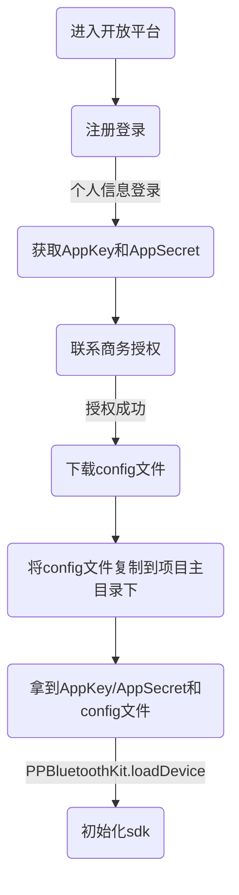

[English Docs](../README_EN.md)  |  [中文文档](../README.md)
相关文档
[乐福开放平台](https://uniquehealth.lefuenergy.com/unique-open-web/#/document)  |    [PPBluetoothKit Android SDK](https://lefuhengqi.apifox.cn/doc-3330813)  |    [PPBluetoothKit 微信小程序插件](https://uniquehealth.lefuenergy.com/unique-open-web/#/document?url=https://lefuhengqi.apifox.cn/doc-2625745)

[iOS示例程序地址](https://gitee.com/shenzhen-lfscale/bluetooth-kit-iosdemo.git)

# 快速链接
- [1.概述](../README.md)
- [2.集成方式](Integration.md)
- [3.设备扫描](SearchDevice.md)
- [4.人体秤接入](BodyScaleIntegrate.md)
- [5.厨房秤接入](KitchenScaleIntegrate.md)
- [6.计算库使用](Calculate.md)

# 集成方式

## 1.1 申请AppKey、AppSecret和config文件

- 先到[乐福开放平台](https://uniquehealth.lefuenergy.com/unique-open-web/#/document)申请AppKey、AppSecret和config文件
- 将config文件放到项目的主目录下



## 1.2 在`Podfile`文件中添加`PPBluetoothKit `、`PPCalculateKit `，并执行`pod install`

```
# 设备连接相关：PPBluetoothKit
# 计算库相关：PPCalculateKit
pod 'PPCalculateKit'
pod 'PPBluetoothKit'
```

## 1.3 在`Info.plist`文件中添加蓝牙权限

```
<key>NSBluetoothAlwaysUsageDescription</key>
<string>需要您的同意,使用蓝牙连接设备</string>
<key>NSBluetoothPeripheralUsageDescription</key>
<string>需要您的同意,使用蓝牙连接设备</string>
```

## 1.4 SDK初始化

```
// Demo中提供的appKey和appSecrect默认体验1个月
//请务必更换您自己的AppKey、AppSecret、配置文件路径，否则您的应用可能无法正常使用本SDK功能。需要增加设备配置请联系我司销售顾问

PPBluetoothManager.loadDevice(withAppKey: "lefu49d9158e653459f2", appSecrect: "YMEWS/CcgomjxqKWubSV+nlU+6qm582gDFOpc1JyiUk=", filePath: Bundle.main.path(forResource: "lefu", ofType: "config")!)
```

## 1.5 导入库

```
import PPBluetoothKit
import PPCalculateKit
```

## 1.6 运行环境

由于需要蓝牙连接，Demo需要在真机运行，支持iOS12.0及以上系统

## 1.7 集成常见问题

- 找不到SDK中的方法，请检查项目是否正确导入了`PPBluetoothKit `
- 如果遇到其他问题，请咨询：yanfabu-5@lefu.cc 或联系我们的销售顾问
- 如果你有好的建议或优秀的代码，你可以在Gitee上提交你的请求，我们会非常感谢你

<br/>
<br/>

[上一页: 1.概述](../README.md)
&nbsp;&nbsp;&nbsp;&nbsp;&nbsp;&nbsp;&nbsp;&nbsp;&nbsp;&nbsp;&nbsp;&nbsp;&nbsp;&nbsp;&nbsp;&nbsp;&nbsp;&nbsp;&nbsp;&nbsp;&nbsp;&nbsp;&nbsp;&nbsp;&nbsp;&nbsp;&nbsp;&nbsp;&nbsp;&nbsp;&nbsp;&nbsp;&nbsp;&nbsp;&nbsp;&nbsp;&nbsp;&nbsp;
[下一页: 3.设备扫描](SearchDevice.md)


