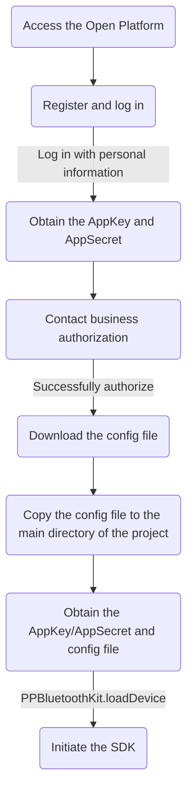

[English Docs](../README_EN.md)  |  [中文文档](../README.md)
Related documents
[Lefu Open Platform](https://uniquehealth.lefuenergy.com/unique-open-web/#/document)  |    [PPBluetoothKit Android SDK](https://lefuhengqi.apifox.cn/doc-3330813)  |    [PPBluetoothKit WeChat mini program plug-in](https://uniquehealth.lefuenergy.com/unique-open-web/#/document?url=https://lefuhengqi.apifox.cn/doc-2625745)

[iOS sample program address](https://gitee.com/shenzhen-lfscale/bluetooth-kit-iosdemo.git)

# Quick Links
- [1.Overview](../README_EN.md)
- [2.Integration method](Integration_EN.md)
- [3.Device scanning](SearchDevice_EN.md)
- [4.Integrated body scale](BodyScaleIntegrate_EN.md)
- [5.Integrated kitchen scale](KitchenScaleIntegrate_EN.md)
- [6.Calculation library usage](Calculate_EN.md)

# Integration method

## 1.1 Apply for AppKey, AppSecret, and config file

- Apply for AppKey, AppSecret, and config file on [LeFou Open Platform](https://uniquehealth.lefuenergy.com/unique-open-web/#/document)
- Place the config file in the main directory of the project.



## 1.2 Add `PPBluetoothKit` and `PPCalculateKit` in the Podfile, then run `pod install`.

```
# Device connection related：PPBluetoothKit
# Calculation library related：PPCalculateKit

pod 'PPCalculateKit'
pod 'PPBluetoothKit'
```

## 1.3 Add Bluetooth permission to the `Info.plist` file

```
<key>NSBluetoothAlwaysUsageDescription</key>
<string>Your consent is required to use Bluetooth to connect devices</string>
<key>NSBluetoothPeripheralUsageDescription</key>
<string>Your consent is required to use Bluetooth to connect devices</string>
```

## 1.4 Initiate the SDK

```
// The appKey and appSecret provided in the demo offer a default experience of 1 month
// Please make sure to replace them with your own AppKey, AppSecret, and configuration file path, otherwise your application may not function properly with this SDK. For device configuration additions, please contact our sales consultant.

PPBluetoothManager.loadDevice(withAppKey: "lefu49d9158e653459f2", appSecrect: "YMEWS/CcgomjxqKWubSV+nlU+6qm582gDFOpc1JyiUk=", filePath: Bundle.main.path(forResource: "lefu", ofType: "config")!)
```

## 1.5 Importing libraries

```
import PPBluetoothKit
import PPCalculateKit
```

## 1.6 Instructions for use

Since Bluetooth connection is required, the demo needs to be run on a real device and supports iOS 12.0 and above.

## 1.7 Common integration issues

- If you cannot find a method in the SDK, check if `PPBluetoothKit` has been imported correctly in your project.
- If you encounter other issues, consult yanfabu-5@lefu.cc or contact our sales consultant.
- We appreciate your valuable suggestions and excellent code contributions on Gitee.

<br/>
<br/>

[Previous page: 1.Overview](../README_EN.md)
&nbsp;&nbsp;&nbsp;&nbsp;&nbsp;&nbsp;&nbsp;&nbsp;&nbsp;&nbsp;&nbsp;&nbsp;&nbsp;&nbsp;&nbsp;&nbsp;&nbsp;&nbsp;&nbsp;&nbsp;&nbsp;&nbsp;&nbsp;&nbsp;&nbsp;&nbsp;&nbsp;&nbsp;&nbsp;&nbsp;&nbsp;&nbsp;&nbsp;&nbsp;&nbsp;&nbsp;&nbsp;&nbsp;
[Next page: 3.Device scanning](SearchDevice_EN.md)


