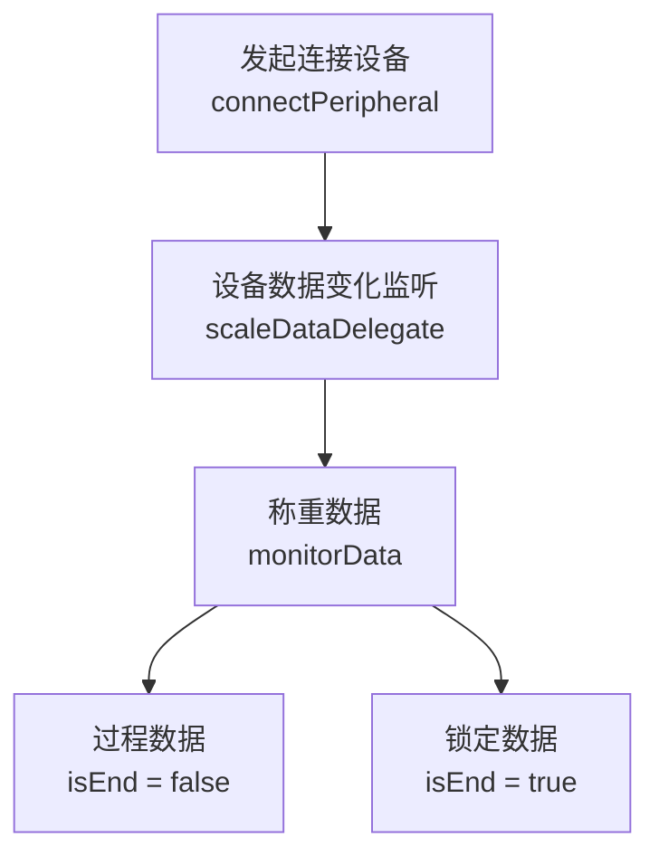
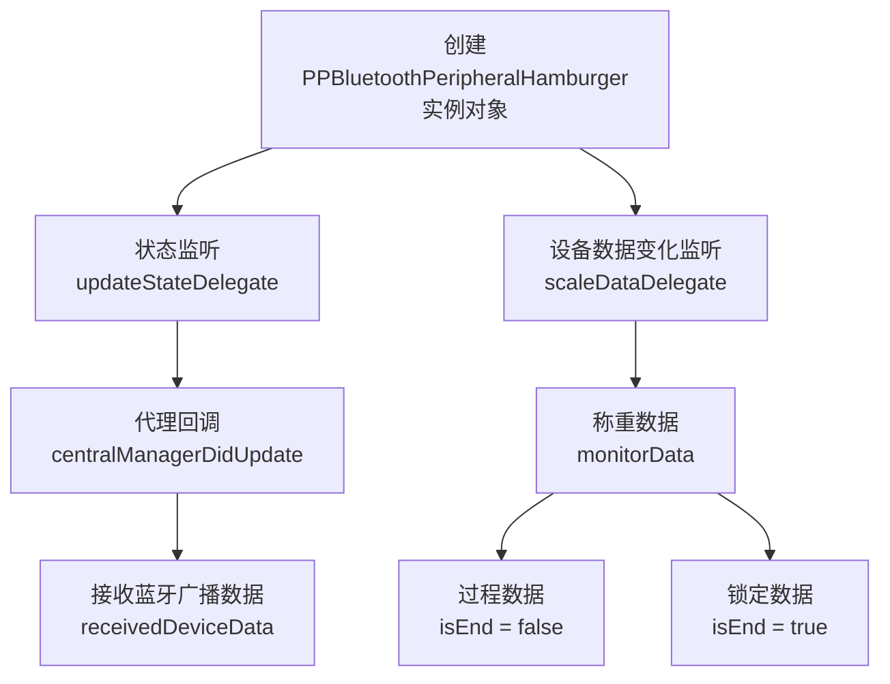

[English Docs](../README_EN.md)  |  [中文文档](../README.md)
相关文档
[乐福开放平台](https://uniquehealth.lefuenergy.com/unique-open-web/#/document)  |    [PPBluetoothKit Android SDK](https://lefuhengqi.apifox.cn/doc-3330813)  |    [PPBluetoothKit 微信小程序插件](https://uniquehealth.lefuenergy.com/unique-open-web/#/document?url=https://lefuhengqi.apifox.cn/doc-2625745)

[iOS示例程序地址](https://gitee.com/shenzhen-lfscale/bluetooth-kit-iosdemo.git)

# 快速链接
- [1.概述](../README.md)
- [2.集成方式](Integration.md)
- [3.设备扫描](SearchDevice.md)
- [4.人体秤接入](BodyScaleIntegrate.md)
- [5.厨房秤接入](KitchenScaleIntegrate.md)
- [6.计算库使用](Calculate.md)

# 厨房秤接入

## 厨房秤分类：

注：运行Demo程序，扫描设备，可以获得设备的`PeripheralType`，不同`PeripheralType`的设备“初始化方式”和“支持的功能”有区别，以下为`厨房秤`的`PeripheralType `:

| 分类枚举 | 使用示例类 | 连接方式 | 设备类型 | 协议类型 |  
|------|--------|--------|--------|-----|  
| PPDevicePeripheralTypePeripheralEgg | DeviceEggViewController | 连接 | 厨房秤 | 2.x |  
| PPDevicePeripheralTypePeripheralFish | DeviceFishViewController | 连接 | 厨房秤 | 3.x |  
| PPDevicePeripheralTypePeripheralGrapes | DeviceGrapesViewController | 广播 | 厨房秤 | 2.x |  
| PPDevicePeripheralTypePeripheralHamburger | DeviceHamburgerViewController | 广播 | 厨房秤 | 3.x |

## 功能说明:

### 1.1 PPDevicePeripheralTypePeripheralEgg功能说明 -DeviceEggViewController

**注意：**

- 默认已处理完蓝牙权限和开关检测，并匹配到PPDevicePeripheralType的类型为PPDevicePeripheralTypePeripheralEgg，2.x /连接 /厨房秤

具体的初始化方式和功能演示，请参考本Demo中`DeviceEggViewController`类

#### 1.1.1 称重逻辑

### 1.2 PPDevicePeripheralTypePeripheralFish功能说明 -DeviceFishViewController

**注意：**

- 默认已处理完蓝牙权限和开关检测，并匹配到PPDevicePeripheralType的类型为PPDevicePeripheralTypePeripheralFish，3.x /连接 /厨房秤

具体的初始化方式和功能演示，请参考本Demo中`DeviceFishViewController`类

### 1.3 PPDevicePeripheralTypePeripheralGrapes功能说明 -DeviceGrapesViewController

**注意：**

- 默认已处理完蓝牙权限和开关检测，并匹配到PPDevicePeripheralType的类型为PPDevicePeripheralTypePeripheralGrapes，2.x /广播 /厨房秤

具体的初始化方式和功能演示，请参考本Demo中`DeviceGrapesViewController`类

### 1.4 PPDevicePeripheralTypePeripheralHamburger功能说明 -DeviceHamburgerViewController

**注意：**

- 默认已处理完蓝牙权限和开关检测，并匹配到PPDevicePeripheralType的类型为PPDevicePeripheralTypePeripheralHamburger，3.x /广播 /厨房秤

具体的初始化方式和功能演示，请参考本Demo中`DeviceHamburgerViewController`类

 
 

[上一页: 4.人体秤接入](BodyScaleIntegrate.md)
&nbsp;&nbsp;&nbsp;&nbsp;&nbsp;&nbsp;&nbsp;&nbsp;&nbsp;&nbsp;&nbsp;&nbsp;&nbsp;&nbsp;&nbsp;&nbsp;&nbsp;&nbsp;&nbsp;&nbsp;&nbsp;&nbsp;&nbsp;&nbsp;&nbsp;&nbsp;&nbsp;&nbsp;&nbsp;&nbsp;&nbsp;&nbsp;&nbsp;&nbsp;&nbsp;&nbsp;&nbsp;&nbsp;
[下一页: 6.计算库使用](Calculate.md)

