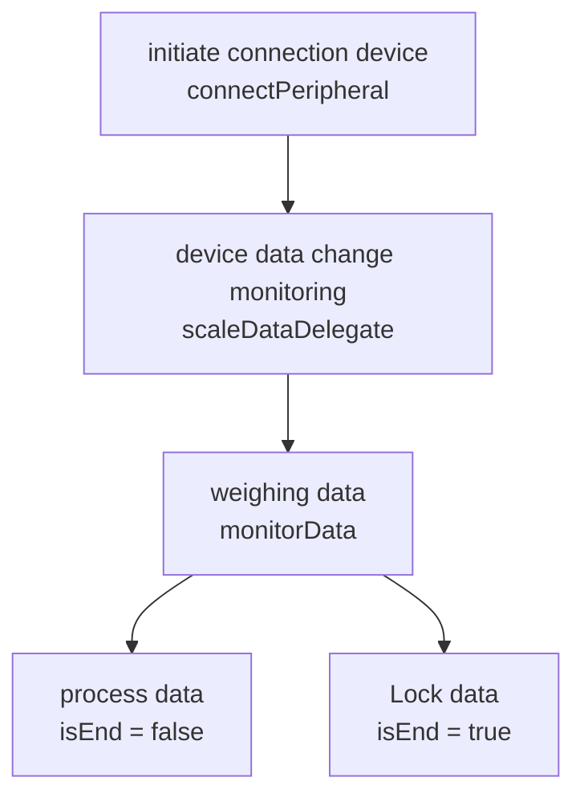
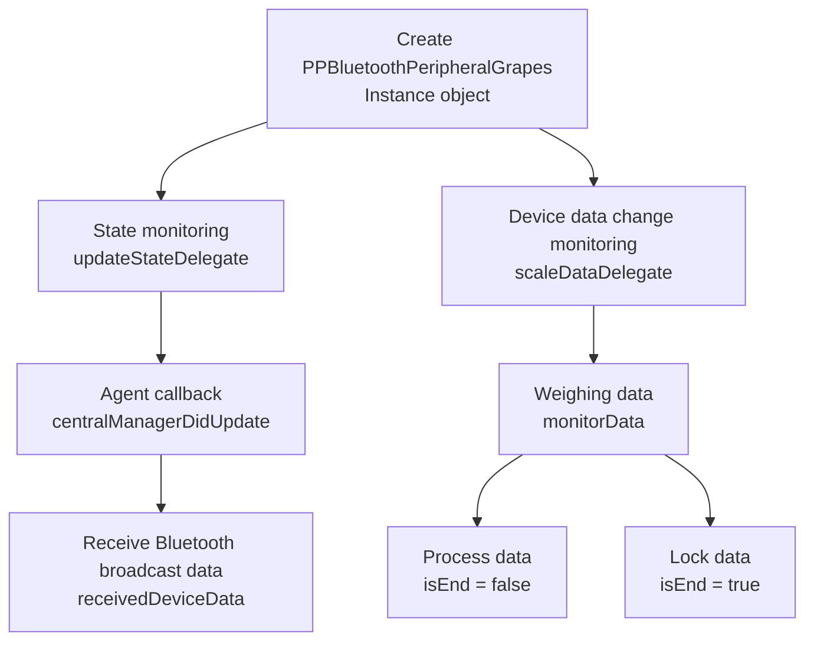

[English Docs](../README_EN.md)  |  [中文文档](../README.md)
Related documents
[Lefu Open Platform](https://uniquehealth.lefuenergy.com/unique-open-web/#/document)  |    [PPBluetoothKit Android SDK](https://lefuhengqi.apifox.cn/doc-3330813)  |    [PPBluetoothKit WeChat mini program plug-in](https://uniquehealth.lefuenergy.com/unique-open-web/#/document?url=https://lefuhengqi.apifox.cn/doc-2625745)

[iOS sample program address](https://gitee.com/shenzhen-lfscale/bluetooth-kit-iosdemo.git)

# Quick Links
- [1.Overview](../README_EN.md)
- [2.Integration method](Integration_EN.md)
- [3.Device scanning](SearchDevice_EN.md)
- [4.Integrated body scale](BodyScaleIntegrate_EN.md)
- [5.Integrated kitchen scale](KitchenScaleIntegrate_EN.md)
- [6.Calculation library usage](Calculate_EN.md)

# Integrated kitchen scale

## Kitchen scale classification：

Note: Run Demo program and scan the device to get the `PeripheralType` of the device. The "initialization method" and "supported functions" of different `PeripheralType` devices are different. The following is the `PeripheralType` of `Kitchen Scale`:

| Classification enumeration | Usage example class | Connection method | Device type | Protocol type |
|------|--------|--------|--------|-----|
| PPDevicePeripheralTypePeripheralEgg | DeviceEggViewController | Connections | Kitchen Scales | 2.x |
| PPDevicePeripheralTypePeripheralFish | DeviceFishViewController | Connections | Kitchen Scales | 3.x |
| PPDevicePeripheralTypePeripheralGrapes | DeviceGrapesViewController | Broadcast | Kitchen Scale | 2.x |
| PPDevicePeripheralTypePeripheralHamburger | DeviceHamburgerViewController | Broadcast | Kitchen Scale | 3.x |

## Function Description:

### 1.1 PPDevicePeripheralTypePeripheralEgg Function Description-DeviceEggViewController

**Notice:**

- By default, Bluetooth permission and switch detection have been processed, and the type of PPDevicePeripheralType matched is PPDevicePeripheralTypePeripheralEgg, 2.x/Connection/Kitchen Scale

For specific initialization methods and functional demonstrations, please refer to the `DeviceEggViewController` class in this Demo

#### 1.1.1 Weighing logic

### 1.2 PPDevicePeripheralTypePeripheralFish Function Description-DeviceFishViewController

**Notice:**

- By default, Bluetooth permission and switch detection have been processed, and the type of PPDevicePeripheralType matched is PPDevicePeripheralTypePeripheralFish, 3.x/Connection/Kitchen Scale

For specific initialization methods and functional demonstrations, please refer to the `DeviceFishViewController` class in this Demo

### 1.3 PPDevicePeripheralTypePeripheralGrapes Function Description-DeviceGrapesViewController

**Notice:**

- By default, Bluetooth permissions and switch detection have been processed, and the type matched to PPDevicePeripheralType is PPDevicePeripheralTypePeripheralGrapes, 2.x/Broadcast/Kitchen Scale

For specific initialization methods and functional demonstrations, please refer to the `DeviceGrapesViewController` class in this Demo

### 1.4 PPDevicePeripheralTypePeripheralHamburger Function Description-DeviceHamburgerViewController

**Notice:**

- By default, Bluetooth permission and switch detection have been processed, and the type matched to PPDevicePeripheralType is PPDevicePeripheralTypePeripheralHamburger, 3.x/Broadcast/Kitchen Scale

For specific initialization methods and functional demonstrations, please refer to the `DeviceHamburgerViewController` class in this Demo

 
 

[Previous page: 4.Integrated body scale](BodyScaleIntegrate_EN.md)
&nbsp;&nbsp;&nbsp;&nbsp;&nbsp;&nbsp;&nbsp;&nbsp;&nbsp;&nbsp;&nbsp;&nbsp;&nbsp;&nbsp;&nbsp;&nbsp;&nbsp;&nbsp;&nbsp;&nbsp;&nbsp;&nbsp;&nbsp;&nbsp;&nbsp;&nbsp;&nbsp;&nbsp;&nbsp;&nbsp;&nbsp;&nbsp;&nbsp;&nbsp;&nbsp;&nbsp;&nbsp;&nbsp;
[Next page: 6.Calculation library usage](Calculate_EN.md)

